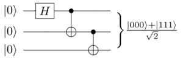

<head>
    
    
</head>

> For the requirement of my graduation project and change of researching intrest, based upon the github forum of [IBM Qiskit](https://github.com/OUCliuxiang/qiskit-iqx-tutorials/blob/63f6d52747716d90c8f43eb16d110bcdd39dda05/qiskit) (and its [community](https://github.com/OUCliuxiang/qiskit-community-tutorials)) I start a quantum machine learning studying process since Dec.2019. However, I do not forgive deep learning at all due to Lu & Zhaoyang's project. Now I record all my studying experience here as a series articles for myself after that as well as others who have a urgent need about QML.
> 
> This is the first article of the series.

## Libraries used in this article
~~~python
import numpy as np 
from qiskit import (
    IBMQ, 
    QuantumCircuit, 
    QuantumRegister, 
    ClassicalRegister, 
    Aer
)
from qiskit.visualization import plot_histogram, plot_state_city
from qiskit.tools.monitor import job_monitor
~~~

## Build a basic quantum circuit
Here we create a basic quantum circuit comprised of three qubits.
~~~python
circ = QuantumCircuit(QuantumRegister(3)) 
# apply and alloc three quantum bits as register  
# parameters of QuantumCircuit():  
# QuantumRegister(int ), ClassicalRegister(int )  
# or (int, (int))  
# the only integer parameter stands for the qubit(s)  
~~~

After creation, gate("operation") can be addded to manipuate registers. Considering the below operation:

$$|\psi\rangle = \frac{|000\rangle+|111\rangle}{\sqrt{2}}. $$  
Its circuit diagram is illustrated below:

This is a quantum quantum circuit that makes a three qubit [GHZ](https://en.wikipedia.org/wiki/Greenberger%E2%80%93Horne%E2%80%93Zeilinger_state) state.  We'd know by default that each qubits in register is intilized to 
$\|0\rangle$.  
To make such GHZ state, we apply the following gates:  
1. A Hadamard gate H on qubit 0, which puts it into the superposition state $\frac{|0\rangle + |1\rangle}{\sqrt{2}}$.
2. A controlled-Not operation $\left(C_X\right)$ between qubit 0 and qubit 1.
3. A controlled-Not operation between qubit 0 and qubit 2.

On an ideal quantum computer, the state produced by running this circuit would be the GHZ state above.  
In IBM Qiskit operations can be added to circuit one by one, as shown below.

~~~python
circ.h(0)   
# add a H gate on qubit 0(this is index), putting it in superposition  
circ.cx(0, 1)   
# add a CX(C-NOT) gate on control qubit 0 and target qubit 1, putting  
# the qubits in Bell state. CAUTION: 'BELL' will be explain below
circ.cx(0, 2)
# add a CX(C-NOT) gate on control qubit 0 and target qubit 2, putting
# the qubits in GHZ state.
~~~

